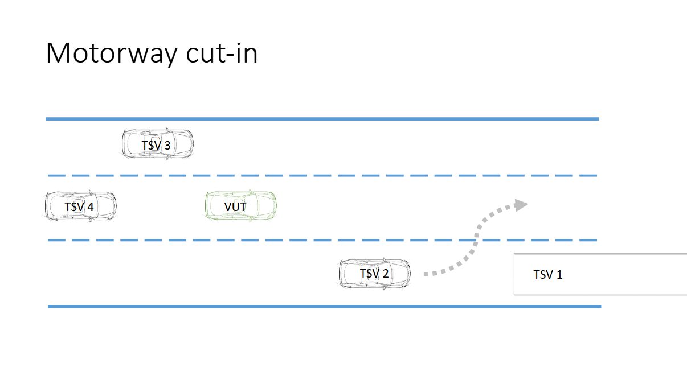
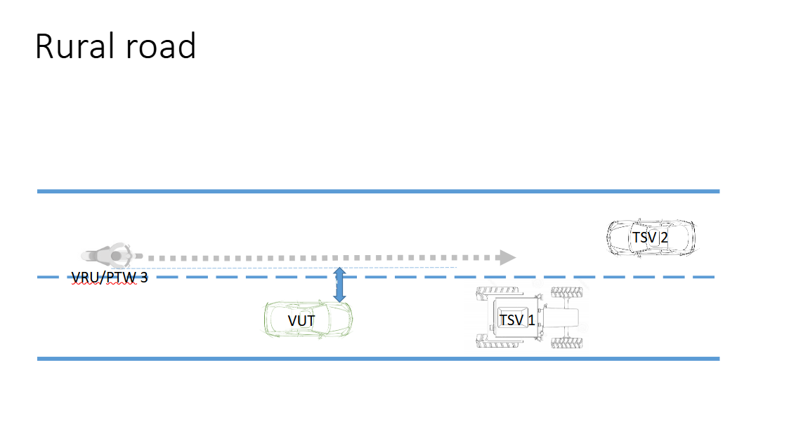
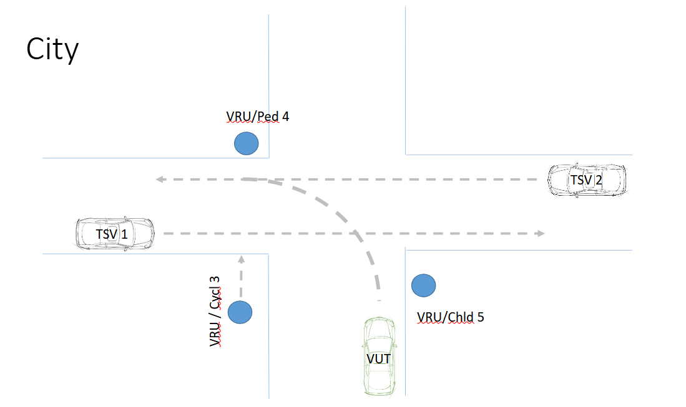

# Solid-State LiDAR Benchmarking for Road Traffic Scenarios

This repository contains MATLAB scripts designed to benchmark solid-state LiDAR performance across a variety of real-world road scenarios. The goal of this project is to evaluate how well different LiDAR configurations perform in diverse environments to support applications in autonomous driving and advanced driver-assistance systems (ADAS).

## Project Overview

Solid-state LiDARs are compact, reliable, and cost-effective sensors suitable for automotive applications. Understanding how they perform in different road layouts and traffic conditions is essential for selecting the right sensor configuration for safety-critical systems.

## Simulation Scripts & Outputs

There are **three main MATLAB scripts**, each representing a distinct road environment. Running these scripts will generate the **minimum LiDAR requirements** (such as field of view, range, and resolution) necessary to ensure safe and efficient object detection in each scenario.

| Script                  | Scenario Description                     |
|------------------------|-------------------------------------------|
| `scenario_1_highway.m` | Simulates highway conditions with fast-moving traffic and merging lanes. |
| `scenario_2_rural.m`   | Represents village or rural roads with narrow cross section and mixed object types. |
| `scenario_3_urban.m`   | Models urban intersections and cross traffic with occlusions and dense object distribution. |

Each script outputs:
- Required minimum specs for LiDAR (e.g., horizontal/vertical FOV, range)
- Tables summarizing the sensor coverage demand

### Key Road Scenarios

Each scenario is simulated in MATLAB and includes specific challenges to test the LiDAR's ability to detect and classify objects.

---

#### Highway Intersection

Simulates merging lanes and fast-moving traffic.  
Tests long-range object detection and lane-level accuracy.

---

#### Rural Roads

Represents narrow roads, sharp turns, and slower traffic.  
Evaluates detection in cluttered and low-reflectivity environments.

---

#### Cross-Section Intersection

Models urban intersections with crossing traffic.  
Analyzes performance in wide fields-of-view and occlusion handling.

---

